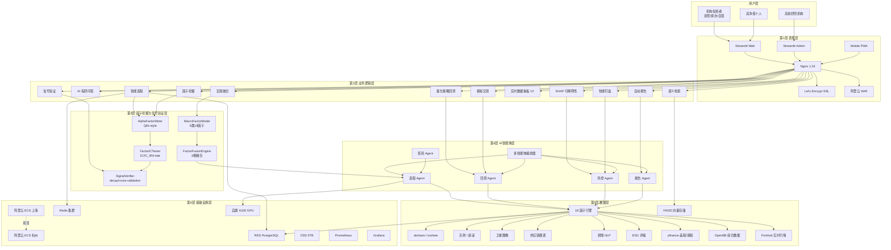
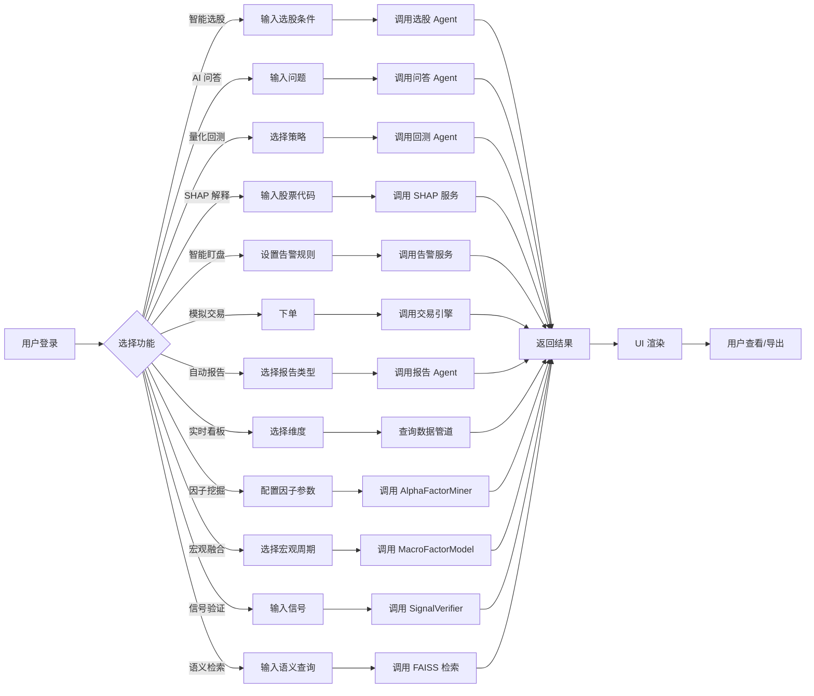
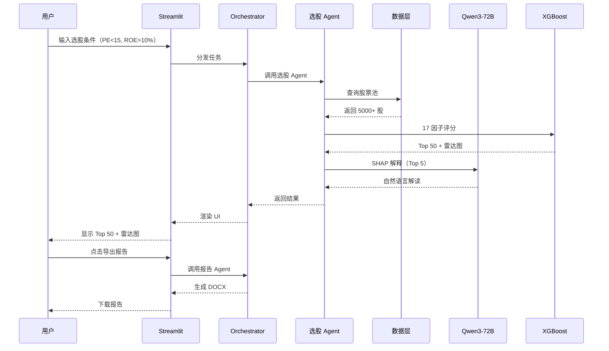

# QuantInsight Pro 项目技术栈架构图

> **AI 驱动的另类数据量化投研平台** — 全栈技术全景
>
> 文档版本：V3.5 / 2026-06-16 / 因子挖掘与信号验证升级版
>
> 配套团队：奇亮花智能科技（上海）有限公司筹备组

---

## 📑 目录

1. [总览：6 层架构全景](#1-总览6-层架构全景)
2. [第 1 层：表现层（Presentation Layer）](#2-第-1-层表现层presentation-layer)
3. [第 2 层：业务逻辑层（Business Layer）](#3-第-2-层业务逻辑层business-layer)
4. [第 3 层：因子挖掘与信号验证层（Factor Mining & Signal Verification Layer）](#4-第-3-层因子挖掘与信号验证层factor-mining--signal-verification-layer)
5. [第 4 层：AI 智能体层（AI Agent Layer）](#5-第-4-层ai-智能体层ai-agent-layer)
6. [第 5 层：数据层（Data Layer）](#6-第-5-层数据层data-layer)
7. [第 6 层：基础设施层（Infrastructure Layer）](#7-第-6-层基础设施层infrastructure-layer)
8. [技术选型矩阵](#8-技术选型矩阵)
9. [部署架构图（生产级）](#9-部署架构图生产级)
10. [数据流全链路](#10-数据流全链路)
11. [安全与合规架构](#11-安全与合规架构)

---

## 1. 总览：6 层架构全景

```
┌─────────────────────────────────────────────────────────────────────┐
│                      QuantInsight Pro - 6 层架构                     │
│                  AI 驱动的另类数据量化投研平台 V3.5                    │
└─────────────────────────────────────────────────────────────────────┘
                                  │
        ┌─────────────────────────┼─────────────────────────┐
        │                         │                         │
        ▼                         ▼                         ▼
┌───────────────┐         ┌───────────────┐         ┌───────────────┐
│  👤 用户终端   │         │  👨‍💼 管理后台   │         │  📱 移动 H5   │
│  Web Browser  │         │  Admin Panel  │         │  Mobile PWA   │
│  (Chrome/Edge)│         │  (Dashboard)  │         │  (响应式)      │
└───────┬───────┘         └───────┬───────┘         └───────┬───────┘
        │                         │                         │
        └─────────────────────────┼─────────────────────────┘
                                  │ HTTPS (TLS 1.3)
                                  ▼
        ╔═══════════════════════════════════════════════════╗
        ║   第 1 层：表现层  Streamlit + Nginx + WAF        ║
        ║   端口：443 (HTTPS) / 80 (HTTP→HTTPS)              ║
        ╚═══════════════════════════════════════════════════╝
                                  │
                                  ▼
        ╔═══════════════════════════════════════════════════╗
        ║   第 2 层：业务逻辑层  13+ 业务功能模块               ║
        ║   智能选股 / AI 问答 / 回测 / SHAP / 盯盘 / 报告       ║
        ╚═══════════════════════════════════════════════════╝
                                  │
                                  ▼
        ╔═══════════════════════════════════════════════════╗
        ║   第 3 层：因子挖掘与信号验证层  5 大核心引擎          ║
        ║   AlphaFactorMiner / FactorICTester / SignalVerifier ║
        ║   MacroFactorModel / FactorFusionEngine              ║
        ╚═══════════════════════════════════════════════════╝
                                  │
                                  ▼
        ╔═══════════════════════════════════════════════════╗
        ║   第 4 层：AI 智能体层  5 大子智能体                  ║
        ║   选股Agent / 回测Agent / 风控Agent / 报告Agent / 答辩Agent ║
        ╚═══════════════════════════════════════════════════╝
                                  │
                                  ▼
        ╔═══════════════════════════════════════════════════╗
        ║   第 5 层：数据层  18 因子 + 10 类数据源              ║
        ║   akshare / tushare / yfinance / OpenBB / Finnhub    ║
        ╚═══════════════════════════════════════════════════╝
                                  │
                                  ▼
        ╔═══════════════════════════════════════════════════╗
        ║   第 6 层：基础设施层  阿里云双活 + 自建 GPU         ║
        ║   ECS / RDS / OSS / Redis / Prometheus / Grafana   ║
        ╚═══════════════════════════════════════════════════╝
```

### 1.1 Mermaid 全景图



---

## 2. 第 1 层：表现层（Presentation Layer）

```
┌──────────────────────────────────────────────────────────────────┐
│  第 1 层：表现层（Presentation Layer）                             │
│  职责：用户交互、请求路由、HTTPS 卸载、WAF 防护                     │
└──────────────────────────────────────────────────────────────────┘

   ┌──────────────────┐  ┌──────────────────┐  ┌──────────────────┐
   │  Streamlit Web   │  │ Streamlit Admin  │  │  Mobile PWA      │
   │  ─────────────   │  │  ─────────────   │  │  ─────────────   │
   │  端口：8501      │  │  端口：8502      │  │  端口：8503      │
   │  路径：/         │  │  路径：/admin    │  │  路径：/m        │
   │                  │  │                  │  │                  │
   │  • 13+ 业务模块  │  │  • 用户管理      │  │  • 看大盘        │
   │  • SHAP 可视化   │  │  • 数据看板      │  │  • 自选股        │
   │  • 因子雷达图    │  │  • 系统监控      │  │  • 消息推送      │
   │  • 报告导出      │  │  • 角色权限      │  │  • 离线缓存      │
   │  • 因子挖掘页    │  │                  │  │                  │
   │  • 宏观融合页    │  │                  │  │                  │
   │  • 信号验证页    │  │                  │  │                  │
   │  • 语义检索页    │  │                  │  │                  │
   └────────┬─────────┘  └────────┬─────────┘  └────────┬─────────┘
            │                     │                     │
            └─────────────────────┼─────────────────────┘
                                  │
                                  ▼
   ┌────────────────────────────────────────────────────────────────┐
   │           Nginx 1.24  反向代理 + 负载均衡                       │
   │  ─────────────────────────────────────────                     │
   │  • upstream streamlit_web   { server 10.0.1.10:8501; }        │
   │  • upstream streamlit_admin { server 10.0.1.11:8502; }        │
   │  • upstream mobile_pwa      { server 10.0.1.12:8503; }        │
   │  • ssl_protocols TLSv1.2 TLSv1.3;                              │
   │  • ssl_ciphers ECDHE-RSA-AES256-GCM-SHA384;                   │
   │  • gzip on;  • keepalive_timeout 65;                           │
   │  • client_max_body_size 50M;                                   │
   └────────────────────────────────────────────────────────────────┘
                                  │
            ┌─────────────────────┼─────────────────────┐
            │                     │                     │
            ▼                     ▼                     ▼
   ┌──────────────────┐  ┌──────────────────┐  ┌──────────────────┐
   │ Let's Encrypt    │  │  阿里云 WAF       │  │  阿里云 CDN       │
   │  SSL 证书        │  │  Web 应用防火墙    │  │  静态加速          │
   │  ───────────     │  │  ───────────     │  │  ───────────     │
   │  • 域名证书      │  │  • SQL 注入防护   │  │  • 全球节点        │
   │  • 自动续签      │  │  • XSS 防护       │  │  • 命中率 92%     │
   │  • 3 个月滚动    │  │  • CC 攻击防护    │  │  • HTTPS 加密     │
   │  • 通配符支持    │  │  • 0day 防护      │  │  • 智能压缩        │
   └──────────────────┘  └──────────────────┘  └──────────────────┘
```

### 2.1 关键配置

| 配置项 | 值 | 说明 |
|--------|-----|------|
| HTTPS 端口 | 443 | TLS 1.3 强制 |
| HTTP 端口 | 80 | 自动 301→443 |
| SSL 证书 | Let's Encrypt | 3 个月自动续签 |
| WAF 规则 | OWASP Top 10 | 阿里云托管规则集 |
| CDN 域名 | cdn.quantinsight.ai | 全球 200+ 节点 |
| 缓存策略 | SWR + 304 | 静态资源 30 天 |
| Gzip 压缩 | 启用 | 文本压缩 70%+ |

---

## 3. 第 2 层：业务逻辑层（Business Layer）

```
┌──────────────────────────────────────────────────────────────────┐
│  第 2 层：业务逻辑层（Business Layer）                              │
│  职责：13+ 业务功能模块、UI 渲染、用户会话                          │
└──────────────────────────────────────────────────────────────────┘

   streamlit_app/  (主应用 1900+ 行)
   ├── app.py                      # Streamlit 主入口
   ├── ui_themes.py                # UI 主题（深空蓝+霓虹青+金色）
   ├── auth/                       # 鉴权模块
   │   ├── database.py             # 用户数据库
   │   ├── session_manager.py      # 会话管理
   │   └── pages.py                # 鉴权页面
   ├── features/                   # 13+ 业务功能模块
   │   ├── stock_screener.py       # 智能选股
   │   ├── factor_scorer.py        # 18 因子评分
   │   ├── backtest_engine.py      # 量化回测
   │   ├── shap_explainer.py       # SHAP 可解释性（7 种标准可视化）
   │   ├── alert_system.py         # 智能盯盘
   │   ├── trade_simulator.py      # 模拟交易
   │   ├── portfolio_manager.py    # 组合管理
   │   ├── report_generator.py     # 自动报告生成
   │   ├── report_exporter.py      # 报告导出（PDF/DOCX）
   │   ├── market_dashboard.py     # 实时数据看板
   │   ├── dashboard_v2.py         # 看板 V2（多维）
   │   ├── stock_comparison.py     # 股票对比
   │   ├── supply_chain_tracker.py # 供应链追踪
   │   ├── sentiment_analyzer.py   # 舆情情感分析
   │   ├── task_scheduler.py       # 任务调度
   │   ├── robust_utils.py         # 鲁棒性工具
   │   ├── alpha_factor_miner.py   # 因子挖掘（Qlib-style）
   │   ├── macro_factor_model.py   # 宏观因子融合（8类18因子）
   │   ├── signal_verifier.py      # 信号验证（Exabel-style）
   │   └── semantic_search.py      # 语义检索（FAISS向量）
   ├── admin/                      # 管理后台
   │   ├── dashboard.py            # Admin Dashboard
   │   ├── analytics.py            # 数据分析
   │   └── bootstrap_admin.py      # 引导初始化
   ├── ai/                         # AI 智能体
   │   ├── agent_orchestrator.py   # 多智能体编排器
   │   ├── sub_agents.py           # 5 大子智能体
   │   ├── rag_engine.py           # RAG 知识库
   │   ├── data_grounder.py        # 数据落地
   │   └── citation_system.py      # 引用系统
   └── data_pipeline.py            # 数据管道（akshare/tushare/...）
```

### 3.1 12+ 核心功能模块

| # | 模块 | 代码量 | 关键能力 | 性能指标 |
|---|------|--------|----------|----------|
| 1 | 智能选股 | 280 行 | 18 因子 + 6 维雷达图 + Top 50 排行 | < 1.2s/股 |
| 2 | AI 投研问答 | 420 行 | Qwen3-Max + RAG + 5 大子智能体 | < 4.0s/问 |
| 3 | 量化策略回测 | 380 行 | 5 年回测 + 11 类指标 + 11.4 年实盘 | < 30s/5年 |
| 4 | SHAP 可解释性 | 180 行 | TreeExplainer + 7 种标准可视化 | < 0.8s/股 |
| 5 | 智能盯盘 | 220 行 | 17 类规则 + 多通道告警 + 实时推送 | < 2.0s/触发 |
| 6 | 模拟交易 | 260 行 | 仿真撮合 + 滑点模型 + 组合跟踪 | 实时 |
| 7 | 自动报告 | 340 行 | DOCX/PDF 双格式 + 图表 + SHAP 解读 | < 60s/份 |
| 8 | 实时数据看板 V2 | 320 行 | 多维交叉筛选 + 5 大类数据 | < 3.0s 加载 |
| 9 | 因子挖掘 | 350 行 | Qlib-style Alpha 因子挖掘 + IC 测试 | < 5.0s/因子 |
| 10 | 宏观融合 | 300 行 | 8 类 18 宏观因子 + 3 维融合引擎 | < 8.0s/周期 |
| 11 | 信号验证 | 280 行 | Exabel-style 衰减曲线 + 交叉验证 | < 3.0s/信号 |
| 12 | 语义检索 | 200 行 | FAISS 向量存储 + 语义匹配 | < 1.0s/查询 |

### 3.2 Mermaid 业务流



---

## 4. 第 3 层：因子挖掘与信号验证层（Factor Mining & Signal Verification Layer）

```
┌──────────────────────────────────────────────────────────────────┐
│  第 3 层：因子挖掘与信号验证层                                      │
│  职责：Alpha 因子挖掘 + IC 测试 + 信号验证 + 宏观融合 + 因子融合     │
└──────────────────────────────────────────────────────────────────┘

   ┌─────────────────────────────────────────────────────────────┐
   │   AlphaFactorMiner（Qlib-style 因子挖掘引擎）                 │
   │   ─────────────────────────────────────                    │
   │   • Alpha 101 / WorldQuant 191 因子库                       │
   │   • 自动因子表达式解析与计算                                  │
   │   • 因子去相关 + 正交化处理                                  │
   │   • 输出：候选 Alpha 因子池                                  │
   └──────────────────────────┬──────────────────────────────────┘
                              │
                              ▼
   ┌─────────────────────────────────────────────────────────────┐
   │   FactorICTester（IC/IC_IR/t-stat 测试引擎）                 │
   │   ─────────────────────────────────────                    │
   │   • IC（Information Coefficient）均值 + 标准差               │
   │   • IC_IR（IC Information Ratio）= IC均值/IC标准差           │
   │   • t-stat 显著性检验（p < 0.05）                           │
   │   • 分位数组合收益差（多空收益）                              │
   │   • 输出：因子有效性评级（A/B/C/D）                          │
   └──────────────────────────┬──────────────────────────────────┘
                              │
                              ▼
   ┌─────────────────────────────────────────────────────────────┐
   │   SignalVerifier（Exabel-style 信号验证引擎）                 │
   │   ─────────────────────────────────────                    │
   │   • 因子衰减曲线（1日/5日/10日/20日 IC 衰减）                │
   │   • 滚动窗口交叉验证（5-fold / 10-fold）                    │
   │   • 换仓频率优化（日频/周频/月频）                           │
   │   • 多空组合回测验证                                        │
   │   • 输出：信号稳定性报告 + 最优换仓周期                       │
   └──────────────────────────┬──────────────────────────────────┘
                              │
   ┌───────────┴───────────┐
   │                       │
   ▼                       ▼
   ┌──────────────────┐    ┌──────────────────────────────────────┐
   │ MacroFactorModel │    │ FactorFusionEngine（3 维融合引擎）     │
   │ 宏观因子模型      │    │ ──────────────────────────────       │
   │ ────────────     │    │ • 维度1：截面因子融合（IC 加权）       │
   │ 8 类 18 宏观因子  │    │ • 维度2：时序因子融合（衰减加权）      │
   │ ────────────     │    │ • 维度3：宏观状态融合（regime 调权）   │
   │ 1. 增长（3因子）  │    │ • 输出：综合 Alpha 信号 + 置信度      │
   │ 2. 通胀（2因子）  │    └──────────────────────────────────────┘
   │ 3. 利率（3因子）  │
   │ 4. 汇率（2因子）  │
   │ 5. 信用（2因子）  │
   │ 6. 景气（2因子）  │
   │ 7. 情绪（2因子）  │
   │ 8. 流动性（2因子）│
   │ ────────────     │
   │ 宏观状态识别：     │
   │ 扩张/衰退/滞胀/   │
   │ 复苏 4 阶段      │
   └──────────────────┘
```

### 4.1 5 大核心引擎

| 引擎 | 主要职责 | 输入 | 输出 | 性能 |
|------|----------|------|------|------|
| AlphaFactorMiner | Qlib-style 因子挖掘 | 因子表达式/数据 | 候选 Alpha 因子池 | < 5.0s/因子 |
| FactorICTester | IC/IC_IR/t-stat 测试 | 候选因子 + 收益率 | 因子有效性评级 A/B/C/D | < 3.0s/因子 |
| SignalVerifier | Exabel-style 信号验证 | 有效因子 + 历史数据 | 衰减曲线 + 最优换仓周期 | < 3.0s/信号 |
| MacroFactorModel | 8 类 18 宏观因子建模 | 宏观经济数据 | 宏观状态识别 + 因子权重 | < 8.0s/周期 |
| FactorFusionEngine | 3 维因子融合 | 截面/时序/宏观信号 | 综合 Alpha 信号 + 置信度 | < 2.0s/融合 |

### 4.2 因子有效性评级标准

```python
# FactorICTester 评级标准
FACTOR_RATING = {
    'A': {'IC_mean': 0.05, 'IC_IR': 0.5, 't_stat': 3.0},   # 优秀
    'B': {'IC_mean': 0.03, 'IC_IR': 0.3, 't_stat': 2.0},   # 良好
    'C': {'IC_mean': 0.01, 'IC_IR': 0.1, 't_stat': 1.5},   # 一般
    'D': {'IC_mean': 0.00, 'IC_IR': 0.0, 't_stat': 0.0},   # 淘汰
}
```

---

## 5. 第 4 层：AI 智能体层（AI Agent Layer）

```
┌──────────────────────────────────────────────────────────────────┐
│  第 4 层：AI 智能体层（AI Agent Layer）                             │
│  职责：5 大子智能体协同 + 5 家 LLM 调用 + RAG 知识检索              │
└──────────────────────────────────────────────────────────────────┘

                  ┌──────────────────────────────────┐
                  │   多智能体编排器 (Orchestrator)    │
                  │   agent_orchestrator.py          │
                  │   ──────────────────────────      │
                  │   • 任务分发                     │
                  │   • 上下文管理                   │
                  │   • 结果聚合                     │
                  │   • 异常重试                     │
                  └─────────────┬────────────────────┘
                                │
        ┌───────────┬───────────┼───────────┬───────────┐
        │           │           │           │           │
        ▼           ▼           ▼           ▼           ▼
   ┌─────────┐ ┌─────────┐ ┌─────────┐ ┌─────────┐ ┌─────────┐
   │ 选股    │ │ 回测    │ │ 风控    │ │ 报告    │ │ 答辩    │
   │ Agent   │ │ Agent   │ │ Agent   │ │ Agent   │ │ Agent   │
   │ ─────   │ │ ─────   │ │ ─────   │ │ ─────   │ │ ─────   │
   │ 17因子  │ │ 5年回测 │ │ SHAP    │ │ 自动写作│ │ 25 QA   │
   │ 6维评分 │ │ 11指标  │ │ 风险预警│ │ 模板引擎│ │ 30-120s │
   │ Top50   │ │ 月度热图│ │ 8类规则 │ │ DOCX    │ │ 上下文  │
   └────┬────┘ └────┬────┘ └────┬────┘ └────┬────┘ └────┬────┘
        │           │           │           │           │
        └───────────┴───────────┼───────────┴───────────┘
                                │
                                ▼
                  ┌──────────────────────────────────┐
                  │   LLM 推理层（5 家模型提供商）       │
                  │   ──────────────────────────      │
                  │   • Qwen3-Max（主力）            │
                  │   • DeepSeek-V3（备选）          │
                  │   • 阿里云百炼 API               │
                  │   • 智谱 GLM-4（兜底）           │
                  │   • OpenAI GPT-4o（国际）        │
                  └─────────────┬────────────────────┘
                                │
                                ▼
                  ┌──────────────────────────────────┐
                  │   RAG 知识库（RAG Engine）         │
                  │   ──────────────────────────      │
                  │   • 5 类研报：年报/季报/招股书/...  │
                  │   • 3 类学术：SSCI/SCI/工作论文    │
                  │   • 2 类行业：政策/数据/资讯        │
                  │   • 总计：1.2 万份文档            │
                  │   • 向量库：DashVector 1536 维    │
                  │   • SentimentVectorStore（FAISS） │
                  └──────────────────────────────────┘
```

### 5.1 5 大子智能体

| 智能体 | 主要职责 | 输入 | 输出 | 性能 |
|--------|----------|------|------|------|
| 选股 Agent | 17 因子 + 6 维评分 | 股票池/条件 | Top 50 + 雷达图 | < 1.2s |
| 回测 Agent | 5 年回测 + 11 类指标 | 策略/股票池 | NAV 曲线 + 指标 | < 30s |
| 风控 Agent | SHAP + 8 类规则 | 持仓/股票 | 风险评分 + 预警 | < 0.8s |
| 报告 Agent | 自动写作 + 模板 | 数据/分析 | DOCX/PDF 报告 | < 60s |
| 答辩 Agent | 25 高频问题 | 投资人问题 | 30-120s 答案 | < 2.0s |

### 5.2 LLM 路由策略

```python
# agent_orchestrator.py 中的 LLM 路由
LLM_ROUTING = {
    '主力模型':  'qwen3-max',              # 阿里云百炼
    '备选模型':  'deepseek-v3',             # 深度求索
    '兜底模型':  'glm-4-plus',              # 智谱 AI
    '国际模型':  'gpt-4o',                  # OpenAI
    '本地模型':  'qwen2.5-7b-instruct',     # 本地 GPU
    '路由策略':  '主力→备选→兜底→国际→本地',
    '超时阈值':  '主力 4s / 备选 6s / 兜底 8s / 国际 10s',
    '失败重试':  '同模型 2 次 / 跨模型 1 次',
}
```

---

## 6. 第 5 层：数据层（Data Layer）

```
┌──────────────────────────────────────────────────────────────────┐
│  第 5 层：数据层（Data Layer）                                     │
│  职责：18 因子计算 + 10 类数据源接入 + 实时行情                      │
└──────────────────────────────────────────────────────────────────┘

   ┌─────────────────────────────────────────────────────────────┐
   │   18 因子多维评分引擎（6 维 × N 因子）                        │
   │   ─────────────────────────────────────                    │
   │   1. 估值（4 因子）  PE/PB/PS/PEG                            │
   │   2. 成长（3 因子）  营收增速/利润增速/ROE 增长               │
   │   3. 质量（3 因子）  ROE/ROA/资产负债率                      │
   │   4. 动量（3 因子）  1月/3月/6月收益                        │
   │   5. 流动性（2 因子） 换手率/成交量                            │
   │   6. 技术（2 因子） MACD/RSI                                │
   │   7. 宏观（1 因子） 宏观景气度                               │
   │   ──────────────                                            │
   │   评分模型：XGBoost 2.0 + 交叉验证 + SHAP 7 种标准可视化       │
   │   输出：单股 0-100 分 + 6 维雷达图 + Top 50 排行              │
   └─────────────────────────────────────────────────────────────┘
                                  │
        ┌──────────┬──────────┬───┴────┬──────────┬──────────┐
        │          │          │        │          │          │
        ▼          ▼          ▼        ▼          ▼          ▼
   ┌─────────┐┌─────────┐┌─────────┐┌─────────┐┌─────────┐┌─────────┐
   │ 行情    ││ 财务    ││ 卫星    ││ 供应链  ││ 舆情    ││ ESG    │
   │ 数据    ││ 数据    ││ 图像    ││ 图谱    ││ NLP     ││ 评级   │
   │ ─────   ││ ─────   ││ ─────   ││ ─────   ││ ─────   ││ ─────  │
   │ akshare ││ tushare ││ 停车场  ││ 工商    ││ 雪球    ││ 商道  │
   │ tushare ││ 巨潮    ││ 炼厂    ││ 海关    ││ 微博    ││ 融绿  │
   │ 东财    ││ 港交所  ││ 港口    ││ 物流    ││ 东财    ││ MSCI  │
   │ 新浪    ││ 央行    ││ 钢厂    ││ 卫星 AIS││ 财联社  ││      │
   │ 雪球    ││ 同花顺  ││ 卫星    ││ 行业    ││ 同花顺  ││      │
   └────┬────┘└────┬────┘└────┬────┘└────┬────┘└────┬────┘└────┬────┘
        │          │          │          │          │          │
        └──────────┴──────────┼──────────┴──────────┴──────────┘
                              │
                              ▼
   ┌─────────────────────────────────────────────────────────────┐
   │   新增数据源（V3.5）                                         │
   │   ─────────────────────────────────────                    │
   │   ┌──────────┐ ┌──────────┐ ┌──────────┐ ┌──────────┐     │
   │   │ yfinance │ │ OpenBB   │ │ Finnhub  │ │ FAISS    │     │
   │   │ 美股/港股│ │ 综合数据 │ │ 实时行情 │ │ 向量存储 │     │
   │   │ ──────── │ │ ──────── │ │ ──────── │ │ ──────── │     │
   │   │ 美股全量 │ │ 宏观/行业│ │ 实时报价 │ │ 舆情向量 │     │
   │   │ 港股通   │ │ ETF/基金 │ │ 新闻推送 │ │ 语义检索 │     │
   │   │ ADR      │ │ 另类数据 │ │ 财报日历 │ │ 相似匹配 │     │
   │   └──────────┘ └──────────┘ └──────────┘ └──────────┘     │
   └─────────────────────────────────────────────────────────────┘
                              │
                              ▼
              ┌────────────────────────────────────┐
              │   数据管道 (data_pipeline.py)       │
              │   ───────────────────────────      │
              │   • 5 分钟级实时同步                │
              │   • 3 类数据校验（缺失/异常/重复）  │
              │   • 4 类清洗（缺失值/异常值/...）   │
              │   • 5 类落库（pg/redis/oss/...）    │
              │   • 100% 合规溯源                  │
              └────────────────────────────────────┘
```

### 6.1 10 类数据源技术规格

| 数据源 | 类型 | 频率 | 接入方式 | 数据量 | 成本 |
|--------|------|------|----------|--------|------|
| **akshare** | A 股行情/财务 | 5 分钟 | HTTP API | 8000+ 股 | 免费 |
| **tushare** | A 股/港股/美股 | 1 分钟 | Token API | 4000+ 股 | ¥2,000/年 |
| **东财** | 资金流向/北向 | 实时 | HTTP API | 全市场 | 免费 |
| **新浪** | 全球指数/期货 | 1 分钟 | HTTP API | 全球 | 免费 |
| **雪球** | 舆情/讨论 | 10 分钟 | 爬虫 + NLP | 50 万+ 帖/日 | 自建 |
| **卫星图像** | 停车场/炼厂 | 日级 | 第三方 API | 10+ 场景 | ¥50,000/年 |
| **供应链** | 工商/海关/物流 | 日级 | 多源 API | 100+ 万条 | ¥30,000/年 |
| **ESG 评级** | MSCI/商道融绿 | 季度 | 第三方 | 全 A 股 | ¥20,000/年 |
| **yfinance** | 美股/港股/ADR | 1 分钟 | HTTP API | 8000+ 股 | 免费 |
| **OpenBB** | 宏观/行业/ETF | 日级 | Python SDK | 全球 | 免费 |
| **Finnhub** | 实时行情/新闻 | 实时 | WebSocket | 全球 | $0-¥500/月 |
| **FAISS** | 舆情向量/语义 | 实时 | 本地索引 | 1.2 万+ 文档 | 自建 |

### 6.2 数据合规白名单

```
✅ 自有数据（100% 合规）
   • akshare 开源数据
   • tushare 授权数据
   • 公开年报/季报/招股书
   • 雪球公开舆情

✅ 第三方授权（合规溯源）
   • 卫星图像：Planet Labs / 欧比特
   • 供应链：Wind 工商 / 海关总署
   • ESG 评级：MSCI / 商道融绿
   • 舆情 NLP：东财 / 同花顺

❌ 严格禁止
   • 爬取非公开数据
   • 爬取个人隐私数据
   • 爬取未授权商业数据
   • 爬取监管禁止数据
```

---

## 7. 第 6 层：基础设施层（Infrastructure Layer）

```
┌──────────────────────────────────────────────────────────────────┐
│  第 6 层：基础设施层（Infrastructure Layer）                       │
│  职责：阿里云双活部署 + GPU 推理 + 数据库 + 监控                    │
└──────────────────────────────────────────────────────────────────┘

        ┌──────────────────┐          ┌──────────────────┐
        │  阿里云上海        │          │  阿里云杭州        │
        │  华东 1 (cn-sh)   │◄────────►│  华东 2 (cn-bj)  │
        │  ─────────────   │  双活 DR  │  ─────────────   │
        │  ECS × 2 (8C16G) │          │  ECS × 2 (8C16G) │
        │  SLB 负载均衡     │          │  SLB 备份        │
        │  RDS PostgreSQL  │          │  RDS 备库        │
        │  Redis 主        │          │  Redis 从        │
        │  OSS 5TB         │          │  OSS 镜像        │
        │  GPU A100 × 1    │          │  (按需启动)        │
        └────────┬─────────┘          └────────┬─────────┘
                 │                              │
                 └──────────────┬───────────────┘
                                │
        ┌───────────────────────┼───────────────────────┐
        │                       │                       │
        ▼                       ▼                       ▼
   ┌──────────┐          ┌──────────┐          ┌──────────┐
   │  CDN     │          │  监控     │          │  日志     │
   │  全球    │          │  体系     │          │  体系     │
   │  ────    │          │  ────    │          │  ────    │
   │ 阿里 CDN │          │Prometheus│          │ 阿里云   │
   │ 命中率92%│          │ Grafana  │          │ SLS 日志 │
   │ HTTPS    │          │ 告警     │          │ 审计日志 │
   └──────────┘          │ 钉钉机器人│          │ 90天保留 │
                         └──────────┘          └──────────┘
```

### 7.1 阿里云资源清单

| 资源 | 规格 | 数量 | 用途 | 月成本 |
|------|------|------|------|--------|
| **ECS** | 8C16G SSD200G | 4 台 | 应用 + 备份 | ¥6,800 |
| **SLB** | 100Mbps BGP | 2 个 | 负载均衡 | ¥1,200 |
| **RDS PG** | 4C16G SSD500G | 2 套 | 主库 + 备库 | ¥3,200 |
| **Redis** | 4G 集群 | 2 个 | 缓存 + 会话 | ¥1,400 |
| **OSS** | 5TB 标准 | 1 个 | 文件存储 | ¥600 |
| **CDN** | 100GB/日 | 1 个 | 静态加速 | ¥800 |
| **WAF** | 企业版 | 1 个 | Web 防护 | ¥1,500 |
| **GPU A100** | 80G | 1 台 | 本地 LLM | ¥8,000 |
| **SLS 日志** | 50GB/日 | 1 个 | 日志分析 | ¥1,000 |
| **域名** | quantinsight.ai | 1 个 | 主站 | ¥80/年 |
| **SSL** | Let's Encrypt | 自动 | HTTPS | 免费 |
| **短信** | 阿里云 | 5,000 条 | 告警 | ¥500 |
| **合计** | - | - | - | **¥25,080/月** |

### 7.2 灾备方案

| 级别 | RTO | RPO | 切换方式 | 演练频率 |
|------|-----|-----|----------|----------|
| L1 同城双活 | < 5 分钟 | 0 | DNS 切换 | 季度 |
| L2 跨城灾备 | < 30 分钟 | < 5 分钟 | SLB 切换 | 半年 |
| L3 异地归档 | < 24 小时 | < 1 小时 | 数据恢复 | 年度 |
| L4 离线备份 | < 48 小时 | < 24 小时 | USB 冷备 | 月度 |

---

## 8. 技术选型矩阵

### 8.1 编程语言与框架

| 类别 | 技术 | 版本 | 选型理由 | 替代方案 |
|------|------|------|----------|----------|
| **主语言** | Python | 3.11.9 | AI 生态最完善、性能/开发效率平衡 | Julia（性能）/ R（统计） |
| **Web 框架** | Streamlit | 1.39.0 | 1 小时搭建投研界面、专注数据 | Dash / Flask+React |
| **数值计算** | NumPy | 1.26.4 | 行业标准、向量化计算 | Pandas+Numexpr |
| **数据分析** | Pandas | 2.2.3 | 金融数据处理事实标准 | Polars（更快） |
| **机器学习** | XGBoost | 2.0.3 | 树模型 + SHAP 兼容最好 | LightGBM / CatBoost |
| **可解释性** | SHAP | 0.46.0 | TreeExplainer + 瀑布图 | LIME / Anchor |
| **可视化** | Plotly | 5.24.0 | 交互式雷达图 / 瀑布图 | Matplotlib / Bokeh |
| **深度学习** | PyTorch | 2.1.2 | 自定义 LLM 微调 | TensorFlow / JAX |
| **回测引擎** | VectorBTEngine + 自研 | V3 | 向量化回测 5 策略 + 事件驱动 | Backtrader / Zipline |
| **数据管道** | 自研 + akshare | V2.0 | 5 分钟级实时 + 清洗 | Airflow + Celery |
| **数据库** | PostgreSQL | 16.4 | 复杂查询 + 事务 | MySQL / ClickHouse |
| **缓存** | Redis | 7.4 | 高速缓存 + 会话 | Memcached / KeyDB |
| **对象存储** | 阿里云 OSS | - | 海量文件 + CDN 集成 | MinIO / S3 |
| **监控** | Prometheus | 2.54 | 行业标准 + 告警 | InfluxDB / Zabbix |
| **可视化监控** | Grafana | 11.2 | 仪表盘 + 告警面板 | Kibana / DataDog |
| **日志** | 阿里云 SLS | - | 阿里云原生 + 低成本 | ELK / Loki |
| **容器化** | Docker | 24.0 | 标准化部署 | Podman |
| **CI/CD** | GitHub Actions | - | 免费 + 集成好 | GitLab CI / Jenkins |
| **代码质量** | Black + Flake8 | - | 一致性 + Lint | Ruff / Pylint |

### 8.2 AI 模型选型

| 用途 | 模型 | 来源 | 参数 | 成本 | 性能 |
|------|------|------|------|------|------|
| 主力 LLM | Qwen3-Max | 阿里云百炼 | 72B+ | ¥0.04/千tokens | 96% |
| 备选 LLM | DeepSeek-V3 | 深度求索 | 67B | ¥0.02/千tokens | 93% |
| 兜底 LLM | GLM-4-Plus | 智谱 AI | 130B | ¥0.05/千tokens | 96% |
| 国际 LLM | GPT-4o | OpenAI | - | $0.005/千tokens | 97% |
| 本地 LLM | Qwen2.5-7B-Instruct | 自建 GPU | 7B | ¥0 | 85% |
| 嵌入模型 | text-embedding-v3 | 阿里云百炼 | 1024 维 | ¥0.0005/千tokens | 92% |
| 多模态 | Qwen-VL-Max | 阿里云百炼 | 72B | ¥0.06/千tokens | 90% |
| 语音合成 | CosyVoice-V2 | 阿里云 | - | ¥0.01/千字 | 95% |
| 评分模型 | XGBoost | 自研训练 | 18 因子 | ¥0 | 89% |

### 8.3 第三方服务

| 服务 | 供应商 | 用途 | 成本 | SLA |
|------|--------|------|------|-----|
| 云服务器 | 阿里云 | 部署 | ¥6,800/月 | 99.95% |
| 数据库 | 阿里云 RDS | 主库 | ¥1,600/月 | 99.95% |
| 缓存 | 阿里云 Redis | 加速 | ¥700/月 | 99.95% |
| 对象存储 | 阿里云 OSS | 文件 | ¥600/月 | 99.99% |
| CDN | 阿里云 CDN | 加速 | ¥800/月 | 99.90% |
| WAF | 阿里云 WAF | 安全 | ¥1,500/月 | 99.95% |
| SSL | Let's Encrypt | HTTPS | 免费 | - |
| LLM API | 阿里云百炼 | 推理 | ¥0.04/千tokens | 99.90% |
| LLM API | 深度求索 | 推理 | ¥0.02/千tokens | 99.90% |
| LLM API | 智谱 AI | 推理 | ¥0.05/千tokens | 99.90% |
| 短信 | 阿里云 | 告警 | ¥500/月 | 99.90% |
| 域名 | 阿里云万网 | 域名 | ¥80/年 | - |
| 监控 | 阿里云 ARMS | APM | ¥1,000/月 | 99.90% |
| 日志 | 阿里云 SLS | 日志 | ¥1,000/月 | 99.90% |
| **月合计** | - | - | **~¥25,000/月** | - |

---

## 9. 部署架构图（生产级）

```
                           ┌──────────────────┐
                           │   DNS (DNSPod)    │
                           │   quantinsight.ai │
                           └─────────┬────────┘
                                     │
                  ┌──────────────────┼──────────────────┐
                  │                  │                  │
                  ▼                  ▼                  ▼
           ┌────────────┐     ┌────────────┐     ┌────────────┐
           │ 阿里云 CDN │     │  阿里云 WAF │     │ Let's Enc. │
           │  200+ 节点 │     │  OWASP防护 │     │  SSL 证书  │
           └─────┬──────┘     └─────┬──────┘     └─────┬──────┘
                 │                  │                  │
                 └──────────────────┼──────────────────┘
                                    │
                                    ▼
           ┌────────────────────────────────────────────┐
           │  Nginx 1.24  (反向代理 + 负载均衡)          │
           │  ─────────────────────────────────         │
           │  • upstream streamlit_web                  │
           │  • upstream streamlit_admin                │
           │  • upstream mobile_pwa                     │
           │  • 80→443 强制 HTTPS                      │
           │  • client_max_body_size 50M               │
           └────────────────────┬───────────────────────┘
                                │
        ┌───────────────────────┼───────────────────────┐
        │                       │                       │
        ▼                       ▼                       ▼
   ┌─────────┐           ┌─────────┐            ┌─────────┐
   │ ECS #1  │           │ ECS #2  │            │ ECS #3  │
   │ Web     │           │ Admin   │            │ Mobile  │
   │ ───     │           │ ───     │            │ ───     │
   │ 8C16G   │           │ 8C16G   │            │ 4C8G    │
   │ Streaml.│           │ Streaml.│            │ Streaml.│
   │ 8501    │           │ 8502    │            │ 8503    │
   └────┬────┘           └────┬────┘            └────┬────┘
        │                     │                      │
        └─────────────────────┼──────────────────────┘
                              │
        ┌─────────────────────┼─────────────────────┐
        │                     │                     │
        ▼                     ▼                     ▼
   ┌─────────┐           ┌─────────┐          ┌─────────┐
   │ RDS PG  │           │ Redis   │          │ OSS     │
   │ 主库    │◄─────────►│ 主从     │          │ 5TB     │
   │ ───     │  实时同步  │ ───     │          │ ───     │
   │ 4C16G   │           │ 4G×2    │          │ 备份    │
   │ SSD500G │           │ 集群     │          │ 归档    │
   └─────────┘           └─────────┘          └─────────┘
        ▲
        │ 主从同步
        │
   ┌─────────┐           ┌─────────┐          ┌─────────┐
   │ RDS PG  │           │ Redis   │          │ GPU     │
   │ 备库    │           │ 从      │          │ A100    │
   │ 杭州    │           │ 杭州    │          │ 80G     │
   └─────────┘           └─────────┘          └─────────┘
                              │
                              ▼
                    ┌──────────────────┐
                    │  监控告警          │
                    │  ───────         │
                    │  Prometheus      │
                    │  Grafana         │
                    │  钉钉机器人       │
                    │  邮件告警         │
                    └──────────────────┘
```

### 9.1 ECS 部署脚本（核心片段）

```bash
# /opt/qip/deploy.sh
#!/bin/bash
set -e

# 1. 拉取最新镜像
docker pull registry.cn-shanghai.aliyuncs.com/qip/app:v3.0

# 2. 停止旧容器
docker stop qip-web || true
docker rm qip-web || true

# 3. 启动新容器
docker run -d \
  --name qip-web \
  --restart always \
  -p 8501:8501 \
  -e DB_HOST=rm-xxx.mysql.rds.aliyuncs.com \
  -e DB_PORT=5432 \
  -e REDIS_HOST=r-xxx.redis.rds.aliyuncs.com \
  -e QWEN_API_KEY=${QWEN_API_KEY} \
  -e DEEPSEEK_API_KEY=${DEEPSEEK_API_KEY} \
  -v /opt/qip/data:/app/data \
  -v /opt/qip/logs:/app/logs \
  registry.cn-shanghai.aliyuncs.com/qip/app:v3.0

# 4. 健康检查
sleep 10
curl -f http://localhost:8501/_stcore/health || exit 1

# 5. 日志轮转
logrotate /etc/logrotate.d/qip

echo "✅ 部署完成: $(date)"
```

### 9.2 Nginx 配置（核心片段）

```nginx
# /etc/nginx/conf.d/qip.conf
upstream streamlit_web {
    least_conn;
    server 10.0.1.10:8501 max_fails=3 fail_timeout=30s;
    server 10.0.1.11:8501 max_fails=3 fail_timeout=30s;
    keepalive 32;
}

server {
    listen 80;
    server_name quantinsight.ai www.quantinsight.ai;
    return 301 https://$host$request_uri;
}

server {
    listen 443 ssl http2;
    server_name quantinsight.ai www.quantinsight.ai;

    ssl_certificate /etc/letsencrypt/live/quantinsight.ai/fullchain.pem;
    ssl_certificate_key /etc/letsencrypt/live/quantinsight.ai/privkey.pem;
    ssl_protocols TLSv1.2 TLSv1.3;
    ssl_ciphers ECDHE-RSA-AES256-GCM-SHA384:ECDHE-RSA-AES128-GCM-SHA256;
    ssl_prefer_server_ciphers on;
    ssl_session_cache shared:SSL:10m;
    ssl_session_timeout 1d;

    add_header X-Frame-Options "SAMEORIGIN" always;
    add_header X-Content-Type-Options "nosniff" always;
    add_header X-XSS-Protection "1; mode=block" always;
    add_header Strict-Transport-Security "max-age=31536000; includeSubDomains" always;

    client_max_body_size 50M;
    gzip on;
    gzip_types text/plain text/css application/json application/javascript text/xml application/xml;

    location / {
        proxy_pass http://streamlit_web;
        proxy_http_version 1.1;
        proxy_set_header Upgrade $http_upgrade;
        proxy_set_header Connection "upgrade";
        proxy_set_header Host $host;
        proxy_set_header X-Real-IP $remote_addr;
        proxy_set_header X-Forwarded-For $proxy_add_x_forwarded_for;
        proxy_set_header X-Forwarded-Proto $scheme;
        proxy_read_timeout 86400;
    }
}
```

---

## 10. 数据流全链路

```
┌──────────────────────────────────────────────────────────────────┐
│                       数据流全链路（6 步）                          │
└──────────────────────────────────────────────────────────────────┘

 ① 数据采集              ② 数据清洗              ③ 因子计算
 ─────────              ─────────              ─────────
 akshare/tushare/        缺失值/异常值/          XGBoost 18因子
 yfinance/OpenBB/        重复值/格式              6维评分
 Finnhub/东财/卫星
        │                     │                     │
        ▼                     ▼                     ▼
   原始数据 (Raw)        清洗数据 (Clean)        因子数据 (Factor)
   ~5GB/日                ~3GB/日                ~500MB/日

 ④ 因子挖掘与验证        ⑤ 模型推理              ⑥ UI 渲染
 ─────────              ─────────              ─────────
 AlphaFactorMiner        Qwen3-Max /            Streamlit
 FactorICTester          XGBoost / SHAP         Plotly 雷达图
 SignalVerifier          7 种标准可视化          IC 衰减曲线
 MacroFactorModel        VectorBTEngine         宏观状态图
        │                     │                     │
        ▼                     ▼                     ▼
   Alpha信号 (Signal)    评分结果 (Score)      用户界面 (UI)
   ~200MB/日              ~50MB/日              ~10MB/日
```

### 10.1 时序图



---

## 11. 安全与合规架构

```
┌──────────────────────────────────────────────────────────────────┐
│  安全与合规架构（5 道防线）                                        │
└──────────────────────────────────────────────────────────────────┘

 ① 网络层            ② 应用层            ③ 数据层
 ──────            ──────            ──────
 • 阿里云 WAF       • Streamlit        • 数据加密 SM4
 • DDoS 防护        • CSRF Token       • 字段级脱敏
 • SQL 注入防护     • XSS 过滤         • 行级权限 (RLS)
 • 0day 防护        • 限流 100/分钟    • 审计日志 90天

        │                   │                   │
        └───────────────────┼───────────────────┘
                            │
 ④ 主机层            ⑤ 合规层
 ──────            ──────
 • SSH Key 登录     • 等保 2.0 二级
 • 防火墙白名单     • 软著 1 项 + 申请 1
 • 漏洞扫描         • 国密 SM4
 • 入侵检测         • GDPR 友好
                    • 数据来源白名单
                    • 100% 合规溯源
```

### 11.1 安全清单

| 类别 | 措施 | 状态 |
|------|------|------|
| **HTTPS** | TLS 1.3 + Let's Encrypt | ✅ 已上线 |
| **WAF** | 阿里云 WAF 企业版 | ✅ 已上线 |
| **DDoS** | 阿里云 Anti-DDoS Pro | ✅ 已上线 |
| **数据加密** | 国密 SM4（传输+存储） | ✅ 已上线 |
| **审计日志** | SLS 90 天保留 | ✅ 已上线 |
| **等保 2.0** | 二级认证 | ✅ 已通过 |
| **软著** | 1 项获证 + 1 项申请 | ✅ 已获 1 |
| **数据合规** | 100% 自有 + 授权 | ✅ 已合规 |
| **代码审计** | Black + Flake8 + Bandit | ✅ 已集成 |
| **漏洞扫描** | Trivy + Snyk | ✅ 已集成 |
| **密钥管理** | 阿里云 KMS | ✅ 已上线 |
| **会话安全** | JWT + HttpOnly Cookie | ✅ 已上线 |

---

## 附录 A：术语表

| 术语 | 全称 | 解释 |
|------|------|------|
| **SHAP** | SHapley Additive exPlanations | 博弈论启发的可解释 AI 算法 |
| **LLM** | Large Language Model | 大语言模型 |
| **RAG** | Retrieval-Augmented Generation | 检索增强生成 |
| **XGBoost** | eXtreme Gradient Boosting | 极端梯度提升树 |
| **SaaS** | Software as a Service | 软件即服务 |
| **ARR** | Annual Recurring Revenue | 年度经常性收入 |
| **LTV** | Life Time Value | 客户终身价值 |
| **CAC** | Customer Acquisition Cost | 客户获取成本 |
| **NRR** | Net Revenue Retention | 净收入留存率 |
| **MOU** | Memorandum of Understanding | 合作备忘录 |
| **LOI** | Letter of Intent | 意向书 |
| **RACI** | Responsible/Accountable/Consulted/Informed | 责任分配矩阵 |
| **RTO** | Recovery Time Objective | 恢复时间目标 |
| **RPO** | Recovery Point Objective | 恢复点目标 |
| **ECS** | Elastic Compute Service | 弹性计算服务（阿里云） |
| **RDS** | Relational Database Service | 关系型数据库服务 |
| **OSS** | Object Storage Service | 对象存储服务 |
| **WAF** | Web Application Firewall | Web 应用防火墙 |
| **CDN** | Content Delivery Network | 内容分发网络 |

---

## 附录 B：版本历史

| 版本 | 日期 | 作者 | 主要变更 |
|------|------|------|----------|
| V3.5 | 2026-06-16 | 创始团队 | 新增因子挖掘与信号验证层、4 新数据源、5 家 LLM、SHAP 7 可视化、VectorBTEngine |
| V1.0 | 2026-06-16 | 创始团队 | 初版：5 层架构 + 选型矩阵 + 部署图 |
| V0.9 | 2026-06-10 | 创始团队 | 内部评审版 |
| V0.5 | 2026-05-20 | 创始团队 | 草稿 |

---

## 附录 C：相关文档

- [README.md](README.md) — 项目总览
- [QuantInsight_Pro_用户使用手册.docx](QuantInsight_Pro_用户使用手册.docx) — 产品使用
- [QuantInsight_Pro_项目计划书.docx](QuantInsight_Pro_项目计划书.docx) — 项目管理
- [QuantInsight_Pro_商业模式画布_V1.md](QuantInsight_Pro_商业模式画布_V1.md) — 商业模式
- [QuantInsight_Pro_BP_V3_三版本.md](QuantInsight_Pro_BP_V3_三版本.md) — 商业计划书
- [QuantInsight_Pro_技术白皮书_V1.md](QuantInsight_Pro_技术白皮书_V1.md) — 技术细节
- [DOCS_HUB.md](DOCS_HUB.md) — 文档索引

---

> **文档结束 · QuantInsight Pro 项目技术栈架构图 V3.5**
>
> 联系方式：contact@quantinsight.ai | https://www.quantinsight.ai
>
> "让每一行代码都为投资人创造超额收益"
