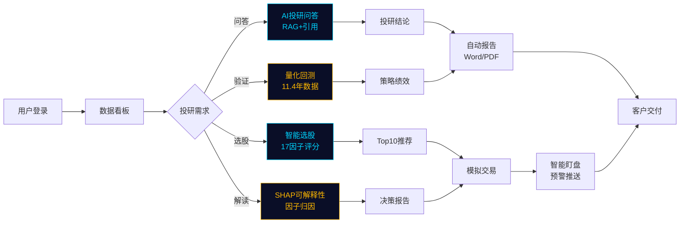
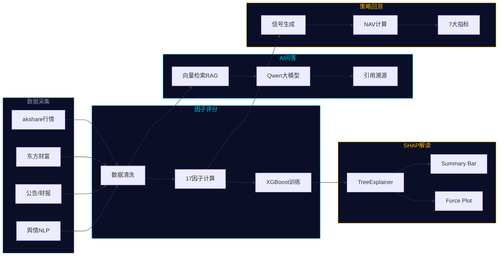
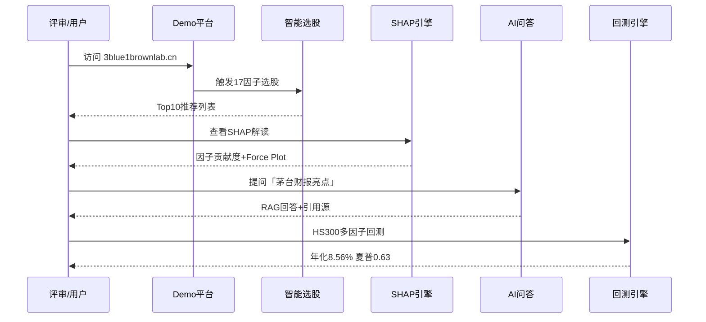
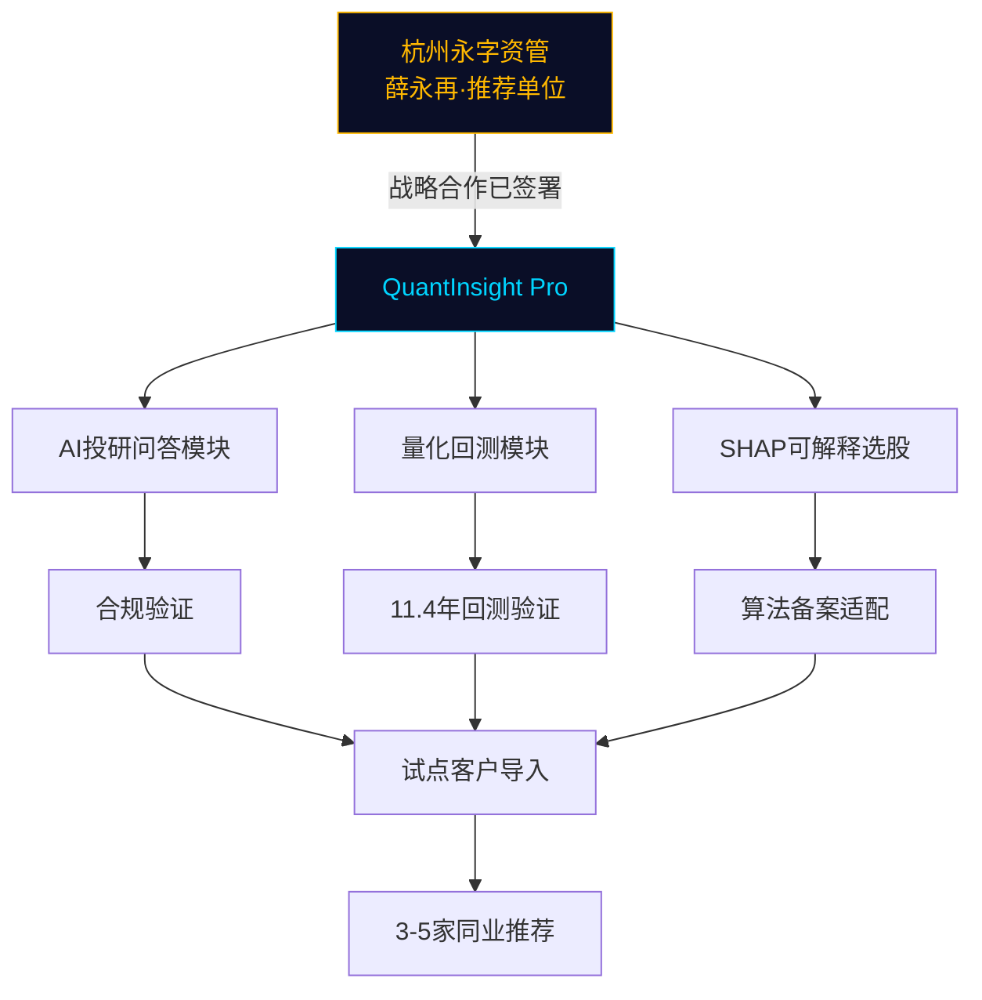
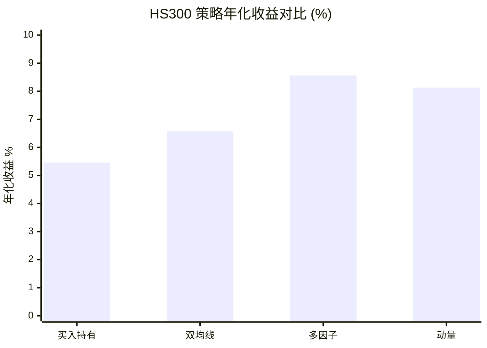

# QuantInsight Pro 逻辑流程图

**项目编号**：2026FINTECH-FINT-0093  
**版本**：AFAC2026 提交包 V1.0

---

## 1. 用户旅程流程

---

## 2. 六层技术架构

```mermaid
flowchart TB
    subgraph L1["应用层 Application"]
        A1[投研终端]
        A2[移动App]
        A3[API接口]
        A4[数据可视化]
    end

    subgraph L2["智能体层 Agent"]
        B1[投研助手]
        B2[因子挖掘]
        B3[智能问答]
        B4[自动报告]
    end

    subgraph L3["服务层 Service"]
        C1[AI引擎]
        C2[策略引擎]
        C3[风控引擎]
        C4[SHAP解释器]
    end

    subgraph L4["数据层 Data"]
        D1[财报/公告]
        D2[新闻舆情]
        D3[产业链]
        D4[消费行为]
        D5[17因子库]
    end

    subgraph L5["算法层 Algorithm"]
        E1[XGBoost]
        E2[SHAP TreeExplainer]
        E3[RAG检索]
        E4[回测引擎MIT]
    end

    subgraph L6["基础设施 Infrastructure"]
        F1[云原生K8s]
        F2[弹性算力]
        F3[实时数据流]
        F4[零信任安全]
    end

    L1 --> L2 --> L3 --> L4 --> L5 --> L6

    style L1 fill:#0A0E27,color:#FFFFFF,stroke:#00D4FF
    style L2 fill:#0A0E27,color:#00D4FF,stroke:#00D4FF
    style L3 fill:#0A0E27,color:#FFFFFF,stroke:#00D4FF
    style L4 fill:#0A0E27,color:#FFB800,stroke:#FFB800
    style L5 fill:#0A0E27,color:#00D4FF,stroke:#00D4FF
    style L6 fill:#0A0E27,color:#8892B0,stroke:#8892B0
```

---

## 3. 核心数据流

---

## 4. 3 分钟 Demo 演示流程

---

## 5. 永字资管合作流程

---

## 6. 回测策略对比（HS300 · T35）

> 多因子策略年化 8.56%，超额基准 3.10%，最大回撤 -38.33% 优于基准 -72.30%。

---

**说明**：以上图表使用 Mermaid 语法，可在 GitHub / VS Code / 飞书文档中直接渲染。  
交互式 HTML 版本见同目录 `交互设计与流程图.html`。
